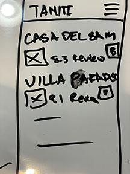
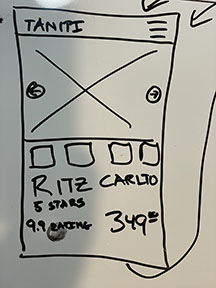

# Usability Guerrilla Testing

## Questions I want to know

How will our people find accommodations on the island?

Is the best way to promote local hotels - using maps or hotel features?

How will users navigate with their mobile device?

** What will be tested? **
Wireframes of user journey to find a hotel.
What is the common path to get to the hotels page?

** When will test material be ready? **
Right away.

** Subjects **
3 random adults capable of booking a hotel
Targetting mothers.

** Low Fidelity Sketch Wireframes **

## The Survey / Test

## Summarize the Qualitative Feedback

## Design Improvements from Feedback

- Add in touch events to accommodate touch screens